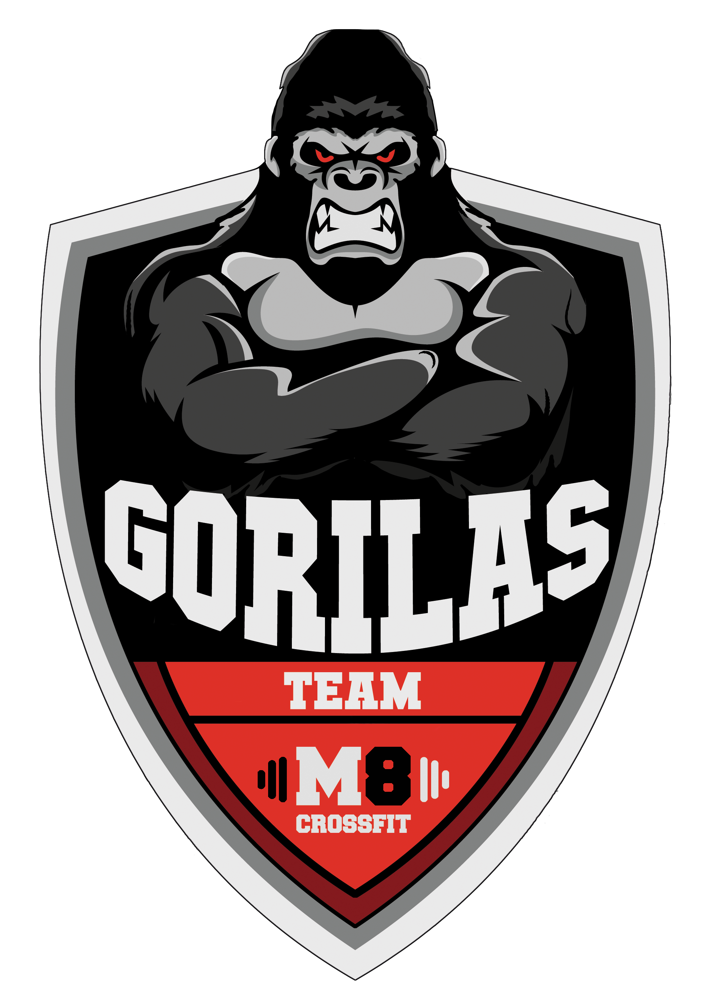

# GorilApp 🦍

> **Tu Gymbro de Entrenamiento.**

Aplicación PWA diseñada para registrar tus entrenamientos de fuerza de forma rápida, intuitiva y con una estética agresiva que te motiva a darlo todo.

## 🚀 Versión 1.2.0 - Gestión Total

### Novedades
- **Gestión de Ejercicios (CRUD)**: Añade, edita y borra ejercicios de tus rutinas al instante.
- **Timers Avanzados**: Nuevos temporizadores estilo marcador LED (Tabata, EMOM, AMRAP, Clock).
- **Control Total**: Cancela cuentas atrás, modifica series y pesos con facilidad.
- **Responsive**: Interfaz optimizada para móvil sin scroll innecesario.

### Características Principales
- 📊 **Registro Local**: Tus datos se guardan en tu dispositivo (DexieDB).
- 📱 **PWA**: Instálala como una app nativa.
- ⚡ **Rápida**: Sin cargas lentas ni conexión obligatoria.

## 🛠️ Tecnologías
- React 19 + Vite
- Dexie.js (IndexedDB wrapper)
- Recharts (Gráficas de progreso)
- Lucide React (Iconos)

---
*GorilApp - Entrena como una bestia.*
