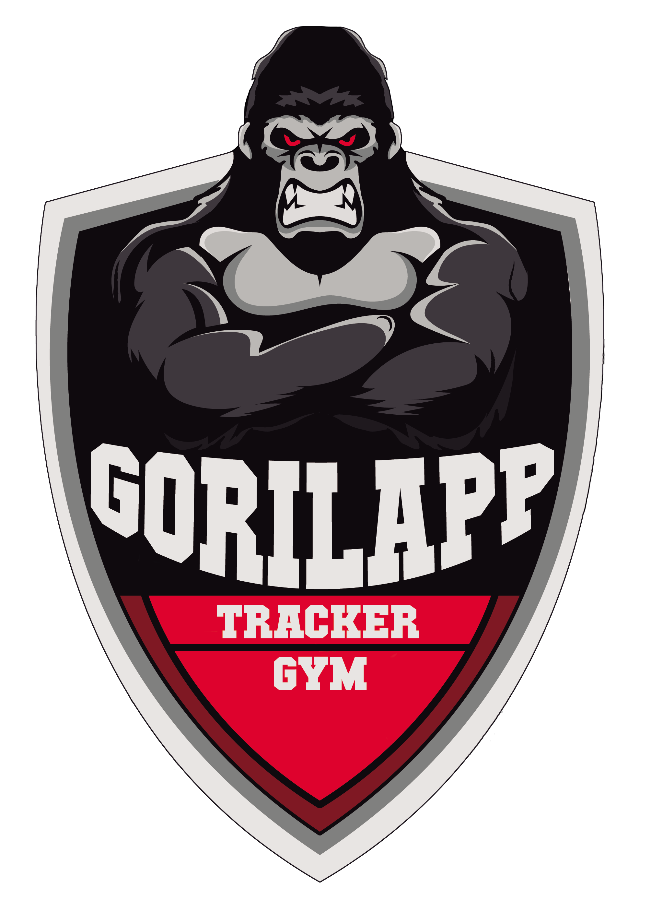

# GorilApp 🦍

> **Tu Gymbro de Entrenamiento.**

Aplicación PWA diseñada para registrar tus entrenamientos de fuerza de forma rápida, intuitiva y con una estética agresiva que te motiva a darlo todo.

## 📜 Historial de Cambios

### v2.1.0 - Navegación Libre, Segundo Plano & Intro Cinemática 🦍
- **Navegación No Secuencial**: Selector de ejercicios táctil en cabecera con indicadores (`0/3`, `1/3`, `✓ 3/3`) para saltar de máquina sin bloqueos.
- **Fin de Sesión Protegido**: Botón dedicado y modal que advierte sobre ejercicios incompletos antes de permitir cerrar.
- **Segundo Plano Continuo**: Auto-guardado en tiempo real en IndexedDB/localStorage y descanso por timestamp absoluto (sin pausas al consultar otras apps en móvil).
- **Intro Cinemática (`intro.mp4`)**: Vídeo de inicio con reproducción fluida y salto directo; omisión inteligente al reanudar entrenos.
- **Optimización Móvil**: Ajuste de botones inferiores en doble fila (`1fr 1fr` + `100%`) eliminando desbordamiento lateral, y cabecera limpia sin pastilla `ONLINE`.

### v2.0.0 - Versión Base Completa 🚀
- **Rutina Septiembre**: 4 sesiones fijas de fuerza con 30 ejercicios, RIR por serie y soporte multimedia.
- **Prevención de Pantalla Fija**: Híbrido NoSleep.js + WakeLock API nativo.
- **PWA Offline**: Service Worker con pre-caché y ejecución 100% en dispositivo.

### v1.2.0 - Gestión Total & Timers Pro 🏋️‍♂️
- **CRUD de Ejercicios**: Añade, edita y elimina ejercicios de tus rutinas al instante.
- **Suite de Timers**: Nuevos modos Tabata, EMOM, AMRAP, For Time y Clock.
- **Estética LED**: Visualización estilo marcador deportivo (7 segmentos).
- **UX**: Cuenta atrás inicial cancelable y sonidos de alerta.
- **Responsive**: Diseño ajustado para evitar scroll en móviles.

### v1.0.0 - Lanzamiento Inicial 🚀
- 📊 **Registro Local**: Base de datos DexieDB privada y offline.
- 📱 **PWA**: Instalable y funcional sin internet.
- 📈 **Progreso**: Historial de sesiones y gráficas de evolución.
- 📋 **Rutinas Base**: Plan PPL (Empuje, Tirón, Pierna) incluido.

## 🛠️ Tecnologías
- React 19 + Vite
- Dexie.js (IndexedDB wrapper)
- Recharts (Gráficas de progreso)
- Lucide React (Iconos)

---
*GorilApp - Entrena como una bestia.*
